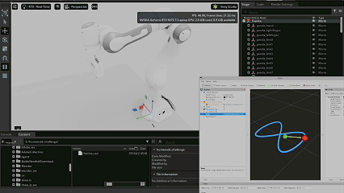

# Franka Isaac Sim End-Effector Tracking

## Demo
\
[Watch the demo video](assets/demo.mp4)
This project uses SAC reinforcement learning algorithm on Franka.

- Franka 7-DoF arm driven through Isaac ROS2 topics
- Time-varying Cartesian target: fixed horizontal figure-eight
- Reinforcement learning core: custom PyTorch SAC
- Smooth control: learned joint-velocity policy with velocity limits and command-smoothness penalties
- Safety: optional collision penalty from Isaac contact sensors on `/collision/*`
- Uncertainty: observation and action noise
- Metrics: tracking error, end-effector speed, orientation alignment, command smoothness, and success flag logged to TensorBoard

The expected Isaac topics are:

```text
/isaac_joint_states
/isaac_joint_commands
/collision/hand/<prim_name>
```
prim_name:\
```panda_hand```,```panda_rightfinger``` etc.

## Challenge Note

See [NOTES.md](NOTES.md) for the short design note covering state, action, reward, trajectory representation, uncertainty, and evaluation metrics.

## Build Environment
### System:
Windows 11
- WSL2 ubuntu 22.04
- Isaac Sim 5.1

The project use the rosbridge between isaac sim and ros2.

## Install

Install ROS2 first. On Ubuntu 22.04 this is typically ROS2 Humble:

```bash
export ROS_DISTRO=humble
```

The code imports these ROS2 Python packages at runtime:

```text
rclpy
rosidl_runtime_py
sensor_msgs
std_msgs
geometry_msgs
visualization_msgs
tf2_ros
```

Install a ROS2 humble and install the required packages with:

```bash
sudo apt install \
  ros-$ROS_DISTRO-rclpy \
  ros-$ROS_DISTRO-rosidl-runtime-py \
  ros-$ROS_DISTRO-sensor-msgs \
  ros-$ROS_DISTRO-std-msgs \
  ros-$ROS_DISTRO-geometry-msgs \
  ros-$ROS_DISTRO-visualization-msgs \
  ros-$ROS_DISTRO-tf2-ros
```

Then source ROS2 before running this project:

```bash
source /opt/ros/$ROS_DISTRO/setup.bash
```

From the repository root, create a virtual environment that can still see ROS2's
system Python packages, then install the pip dependencies:

```bash
python3 -m venv --system-site-packages .venv
source .venv/bin/activate
pip install -r requirements.txt
```

The pip dependencies are:

```text
numpy
gymnasium
torch
tensorboard
```

## Train

Launch Isaac Sim first, confirm the topics exist with `ros2 topic list`, then run:

```bash
python -m rl_tracking.training.torch_isaac --total-timesteps 100000
```

By default, training auto-subscribes to visible `/collision/...` component topics as
`std_msgs/msg/Bool`, falling back to `/collision` if no component topics are visible yet.
This is because previously all collision from different prims were combined and published.
You can change the collision topic and message type using:

```bash
python -m rl_tracking.training.torch_isaac \
  --collision-topic /collision/hand \
  --collision-topic /collision/left_finger \
  --collision-topic /collision/right_finger \
  --collision-msg-type std_msgs/msg/Bool
```

Use `--no-terminate-on-collision` if you want collisions to reduce reward without ending the episode.

The implementation is organized by responsibility:

```text
rl_tracking/core/        kinematics and target trajectories
rl_tracking/envs/        Isaac Gymnasium environment
rl_tracking/algorithms/  SAC implementation under PyTorch
rl_tracking/training/    training entry points
rl_tracking/nodes/       ROS2 policy runner
```

This saves the custom PyTorch SAC model to:

```text
runs/torch_isaac/final_model.pt
```
by default

## Visualize Training

The trainer writes TensorBoard events to:

```text
runs/torch_isaac/tensorboard
```

Start TensorBoard with:

```bash
tensorboard --logdir runs/torch_isaac/tensorboard --host 127.0.0.1 --port 6006
```

Then open:

```text
http://127.0.0.1:6006
```

Velocity-control limits can be tuned with:

```bash
python -m rl_tracking.training.torch_isaac \
  --max-joint-speed 0.8 \
  --action-velocity-scale 1.0
```

The reward includes a small end-effector direction term, a one-sided slow-motion
penalty, collision penalty, command-size penalty, command-smoothness penalty,
joint-limit penalty, and position/velocity tracking terms. These reward constants
are defined in `rl_tracking/envs/isaac.py`.

## Run A Trained Policy

After training:

```bash
python -m rl_tracking.nodes.policy_runner --model runs/torch_isaac/final_model.pt
```

For the MoveIt Panda model, the fixed trajectory center is in `panda_link0`
coordinates near the nominal `panda_hand` pose. The horizontal figure-eight keeps
`z` constant at that center height and starts at that center. Its long axis runs
side-to-side in the horizontal plane.
The kinematic runner first moves to the nearest point on the path, then starts
advancing along the trajectory.

## Visualize The Target Trajectory

Publish the configured target path and the moving target point as ROS2 visualization markers:

```bash
python -m rl_tracking.nodes.trajectory_visualizer --frame-id panda_link0
```

The marker topic is:

```text
/rl_tracking/trajectory_markers
```

RViz can display this directly with a `MarkerArray` display.
